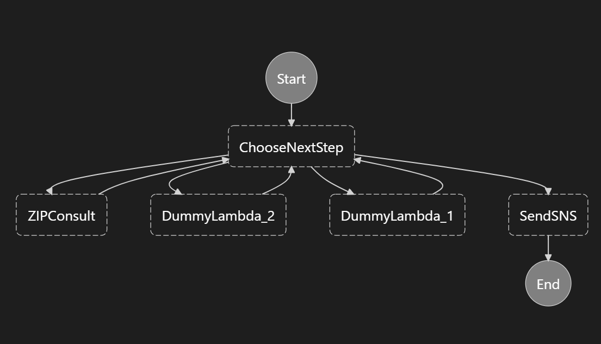

# Step Function POC 
## Description
Simple POC to test locally the use of Step Function with dynamic steps:
* Steps are passed in the input and can be dynamic
* Lambda function that makes a call to viacep API passing zip code and returns the complete information about that CEP
* Publish a message with the zip code information to a SNS topic

## Services used
* Step Function
* Lambda
* SNS
* SQS

## How to execute?
### Requirements
* Docker
* 7Zip or similar
* nodejs
* AWSLocal CLI or AWS CLI

### Steps to execute the application
1) Zip the .js files inside src/handler to a .zip file (each .js file needs to have an associated .zip file)
2) Execute the follow steps on the command line:

    - Start localstack services:
        > docker-compose up -d

    - Create lambdas for the workflow's step:
        > awslocal lambda create-function --function-name ZIPConsult --runtime nodejs12.x --handler step-one-lambda.handler --role arn:aws:iam::0000000000001:role/DummyRole --zip-file fileb://src/handler/step-one-lambda.zip

        > awslocal lambda create-function --function-name DummyLambda1 --runtime nodejs12.x --handler mock-lambda-1.handler --role arn:aws:iam::0000000000001:role/DummyRole --zip-file fileb://src/handler/mock-lambda-1.zip

        > awslocal lambda create-function --function-name DummyLambda2 --runtime nodejs12.x --handler mock-lambda-2.handler --role arn:aws:iam::0000000000001:role/DummyRole --zip-file fileb://src/handler/mock-lambda-2.zip

    - Create SNS topic:
        > awslocal sns create-topic --name sns_topic

    A SQS can be used to validate that a message was sent to SNS
    - Crate SQS queue (`OPTIONAL`): 
        > awslocal sqs create-queue --queue-name=sns_queue

    - Create a SNS subscribe to the SQS (`OPTIONAL`):
        > awslocal sns subscribe --topic-arn arn:aws:sns:us-east-1:000000000000:sns_topic --protocol sqs --notification-endpoint http://localhost:4566/000000000000/sns_queue

    - Create the state machine:
        > awslocal stepfunctions create-state-machine --definition file://state-machine.json --name "DynamicSteps" --role-arn "arn:aws:iam::000000000000:role/DummyRole"

    - Execute workflow:
    In this example, the workflow's input examples are in `input-examples` folder and is basicaly an array with the steps (`steps`), a field indicating the first step (`next_step`) and a field that has the information used by lambdas (`data`). code).
        > awslocal stepfunctions start-execution --state-machine arn:aws:states:us-east-1:000000000000:stateMachine:DynamicSteps --input file://input-examples/input-type-2.json --name test

    - Describe execution:
        > awslocal stepfunctions describe-execution --execution-arn arn:aws:states:us-east-1:000000000000:execution:DynamicSteps:test

    - To check if the message was sent to SNS and then to SQS, use this command (once per message):
        > awslocal sqs receive-message --queue-url http://localhost:4566/000000000000/sns_queue

